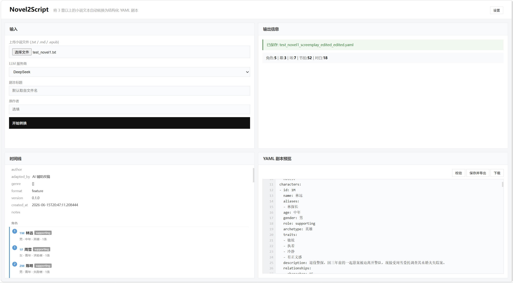

# Novel2Script — AI 辅助小说转剧本工具

## 简介

将 3 章以上小说（EPUB / TXT / Markdown）自动转换为结构化 YAML 剧本(注:角色识别只采样前 3 章来提取角色档案（避免 token 浪费）),即用提示词驱 LLM 把小说文本结构化，再按 Schema 规范输出为 YAML 剧本，前端提供可编辑、可校验、可自定义的交互界面

- 视频介绍链接(百度网盘):里面的.mp4 链接: https://pan.baidu.com/s/1-Jav489_LBZM5NQ0MY9PgA 提取码: wf1v

## 快速开始

```bash
# 1. 安装 pyproject.toml里面的依赖等
cd novel-to-script
uv venv
uv pip install -e .

# 2. 配置 .env
cp .env.example .env
# 编辑 .env，填入 DEEPSEEK_API_KEY=sk-xxx

# 3. 使用
python -m src.cli convert 小说.txt -o output/剧本.yaml   # CLI
python -m src.cli launch                                     # Web UI
```

---

### 使用示例

```bash
# 测试
.\.venv\Scripts\activate
python -m src.cli convert test_novel1.txt -o output1.yaml

.\.venv\Scripts\activate
python -m src.cli convert test_novel2.md -o output2.yaml

.\.venv\Scripts\activate
python -m src.cli convert test_novel2.epub -o output3.yaml

# CLI 转换       文本名称 -o 输出文件名 -t 标题
python -m src.cli convert test_novel.txt -o output/觉醒.yaml --title "觉醒"

# 指定章节范围
python -m src.cli convert 小说.txt -o output.yaml -c 1-5


# 使用 deepseek
python -m src.cli convert 小说.txt -o output.yaml -m deepseek

# 使用 Ollama(本地运行大模型)
python -m src.cli convert 小说.txt -o output.yaml -m ollama

# 校验已有 YAML
python -m src.cli validate output/觉醒.yaml

# 启动 Web UI
python -m src.cli launch

# 指定端口启动Wed UI
python -m src.cli launch --port 8080
```
#### 基本图片介绍
- 主要分为4个板块 输入板块 输出(错误提示板块) 时间线展示板块 修改预览板块
 
- 使用时间线卡片方便用户查看 支持修改 再导出

- 支持设置板块 仅展示用户认为重要的展示 方便快速预览

### 主分支

基于AI LLM 模型转换，基于用户输入的文本生成结构化 YAML 剧本,使用gradioWedUI进行可视化(后被HTML代替),支持CLI + 页面两种操作模式

### 开发分支PR

### **1. UserProcessBetter分支 用户编辑优化**

在主分支基础上添加模仿编译器报错板块,旨在为在用户编辑校验后提供错误提示,方便用户编辑

#### 功能描述

````markdown
```text
┌──────────────┬─────────────────────────┐
│  输入面板     │  输出信息                │
│  文件上传     │  status: 校验通过/失败    │
│  LLM选择     │  stats: 角色/幕/场统计    │
│  标题/作者    │  error-view: 错误详情面板  │
│  [开始转换]   │                         │
├──────────────┼─────────────────────────┤
│  错误提示栏    │  YAML 剧本预览           │
│  (编译器风格)  │  [校验] [保存] [下载]    │
│  逐行显示     │  textarea 可编辑          │
│  错误标红     │                         │
└──────────────┴─────────────────────────┘
用户编辑 YAML → 点「校验」
  │
  ├─ error-view (右上)   → 红色面板展开，错误行标红 + ▶，下方列出错误消息
  │                        用户可以直接看到错误上下文
  │
  └─ error-sidebar (左下) → 全量行列表，错误行红色高亮，
                            右侧缩略错误消息，双向滚动跟随编辑器
                            用户滚动编辑器时，侧边栏同步滚动

用户修复错误 → 再次「校验」→ 通过
  error-view 隐藏
  error-sidebar 恢复灰字
  status 绿色

用户点「保存并导出」
  doSave() → 先自动校验 → 不通过则阻断 + 展示错误 → 通过才写 _edited.yaml
```
````

#### 实现思路

doValidate() — 校验触发
renderErrors(yaml, errors) — 构建错误视图
updateSidebar(count, items) — 侧边栏（编译器风格）
findLine(lines, err) — 行号定位
后端 API fastapi HTTP 路由、文件上传、JSON 解析
后端 API tempfile 临时文件（校验时写入）
后端校验 pydantic 结构校验（model_validate）
后端校验 pyyaml YAML 加载/导出
前端 无 纯原生 JS + CSS，零外部依赖

### **2. AddTimeline 时间线分支**

在主分支基础上添加时间轴功能,方便用户快速预览剧本结构,支持鼠标查看具体相关以及基本修改

#### 功能描述

会在YAML预览板块的左侧生成基于beat的时间线卡片,包含幕,场次,也在头部添加了元信息,人物全介绍,方便用户快速确认YAML生成的大纲,

1. 提供了基本的修改功能如人物对话等
2. 鼠标浮动相关人物卡片上会展示相关人物心理描写(如果llm提取出来存在的话)
3. Summary总结描述即灰色子块可以点击展示当前场景的heading(location_type,location,time)属性
4. 支持点击后提示用户当前summary的行号会在预览板块右下角有提示,方便用户确认summary位置以及方便用户进行修改

| 功能         | 说明                                                                         |
| :----------- | :--------------------------------------------------------------------------- |
| 时间线卡片   | beat 级别卡片，A（动作/蓝）、D（对白/黄）、T（转场/灰）三色区分              |
| 剧本元信息   | 时间线顶部展示标题、作者、来源等 meta 字段                                   |
| 角色总览     | 全部角色以卡片列出，含 ID、姓名、角色定位、性别、年龄、性格特征、关系数      |
| 场景概览     | 每个场景以 summary 文本为标题，点击展开/收起 location_type · location · time |
| 悬浮提示     | 鼠标悬停 beat 卡片时浮动显示人物的 parenthetical 心理状态                    |
| 点击定位     | 点击场景标题 → YAML 编辑器自动滚动到对应 summary 行 + 右下角弹出行号提示     |
| 行内编辑     | 点击任意卡片展开内联 textarea → 修改 → 保存 → 自动回写 YAML                  |
| 行号栏       | YAML 编辑器左侧固定行号 gutter，跟随滚动、跟随编辑刷新                       |
| 双向滚动同步 | 时间线 ↔ YAML 编辑器按比例同步滚动（scrollTop 比例映射）                     |
| 编辑自动刷新 | 用户在 YAML 中修改 → 500ms 防抖后时间线自动重渲染                            |

---

#### 实现思路

| 功能                         | 说明                                                                                                  | 实现函数                                                                                                                                                                                                                                                                                                                                                                                                                                                                                                                                                                                                |
| :--------------------------- | :---------------------------------------------------------------------------------------------------- | :------------------------------------------------------------------------------------------------------------------------------------------------------------------------------------------------------------------------------------------------------------------------------------------------------------------------------------------------------------------------------------------------------------------------------------------------------------------------------------------------------------------------------------------------------------------------------------------------------ |
| 时间线卡片展示               | 按剧本结构（元信息→角色→场景→节拍）以卡片形式呈现，beat 用蓝(A)/黄(D)/灰(T)三色和首字母图标区分类型。 | `parseTimelineData(yaml)`：用状态机+正则逐行扫描 YAML，识别 `meta:` / `characters:` / `structure:` 三个区域边界，提取 meta 的 key:value 对、角色的全部字段（name/role/age/traits/aliases/relationships…）、场景的 scene_number/heading/summary 以及 beat 的 type/description/character/line/parenthetical/transition。`renderTimeline()`：读取解析结果，用字符串拼接生成三块 HTML：meta 区为 `tl-meta-row` 行、角色区为 `tl-char-card` 卡片（圆形头像+ID+姓名+定位+详细属性）、场景区以 `tl-scene` 为容器，每个 beat 渲染为 `tl-beat action\|dialogue\|transition` 卡片，内含图标+内容+隐藏 edit 按钮。 |
| 场景元信息展示               | 场景 summary 作为标题，点击展开/收起当前场景的 location_type、location、time。                        | 渲染时在每个场景 h4 下方生成 `<div class="tl-scene-hover">` 默认隐藏，h4 的 onclick 调用 `this.nextElementSibling.classList.toggle('show')` 切换展示；场景 metadata 在解析阶段从 `location_type:` / `location:` / `time:` 行提取存入 `sceneInfos[sceneIdx]`，beat 解析时附带挂到每个 beat 对象上（sceneLocType / sceneLoc / sceneTime），渲染时由每场景第一个 beat 提供。                                                                                                                                                                                                                               |
| 悬浮提示                     | 鼠标悬停 beat 卡片时浮动显示人物的 parenthetical 心理状态。                                           | `showBeatTip(event, idx)`：动态创建 `#beat-tip` div（position:absolute），从 `_tlData.beats[idx].parenthetical` 取值，空值不显示。`hideBeatTip()`：隐藏提示框。beat 卡片上绑定 onmouseenter/onmouseleave 事件。                                                                                                                                                                                                                                                                                                                                                                                         |
| 点击场景标题跳转 YAML 编辑器 | 点击时间线中场景标题 → 编辑器自动滚动到对应 summary 行，右下角弹出行号提示。                          | `scrollToScene(lineNum)`：按 `(lineNum - 5) * 18` 估算像素偏移设置 `editor.scrollTop`，动态创建 `#locate-hint` 浮动提示显示 "▶ 已定位到 Scene {行号}"，1 秒后渐隐；跳转期间 `_clickScrolling` 标志位阻断滚动同步防止被拖回。                                                                                                                                                                                                                                                                                                                                                                            |
| 行内编辑                     | 点击元信息行、角色卡片、beat 卡片均可展开内联编辑器，修改后回写 YAML 并重绘时间线。                   | `editBeatInline(idx)`：在目标卡片后插入 `<div class="tl-edit-inline">` 内含 textarea 预填当前值（action=描述、dialogue=角色:台词、transition=转场标记）+ 保存/取消按钮。`saveBeatEdit()`：读取新值，调用 `updateYamlLine(lines, baseLine, field, value)` 用正则 `/^(\s+){field}:\s*(.+)/` 保留缩进替换值，回写 `editor.value` 后调用 `renderTimeline()` 重绘。元信息编辑走 `editMeta` → `saveMetaEdit`，角色编辑走 `editChar` → `saveCharEdit`，均复用 `updateYamlLine` + `renderTimeline`。                                                                                                            |
| YAML 左侧行号栏              | 编辑器左侧显示固定行号，跟随内容更新和滚动同步。                                                      | `updateLG()`：按换行符计数生成行号 div，强制设置 `gutter.style.height = editor.clientHeight + "px"` 等高。`syncLG()`：同步 `gutter.scrollTop = editor.scrollTop`。`window.refreshLineNumbers()`：统一入口，在 doConvert/doValidate/doSave/renderTimeline 末尾调用确保所有路径都刷新。                                                                                                                                                                                                                                                                                                                   |
| 双向滚动同步                 | 时间线与 YAML 编辑器互相跟随滚动。                                                                    | 用 `scrollTop * (targetHeight / sourceHeight)` 比例映射计算目标滚动位置，`syncing` 标志位防循环触发，`_clickScrolling` 标志位在点击跳转时临时阻断同步。                                                                                                                                                                                                                                                                                                                                                                                                                                                 |

### **3. SchemaSetting分支 预览模块简洁展示 **

在 AddTimeline 基础上，为看不懂代码的用户提供了一个可视化 YAML 字段开关面板，可以自定义预览哪些属性。

#### 功能描述

| 功能         | 说明                                                                                                                                                                                                                                                                                                                                                                                                                                                                                                                                                                                                                                    |
| :----------- | :-------------------------------------------------------------------------------------------------------------------------------------------------------------------------------------------------------------------------------------------------------------------------------------------------------------------------------------------------------------------------------------------------------------------------------------------------------------------------------------------------------------------------------------------------------------------------------------------------------------------------------------- |
| 设置弹窗     | 页面右上角新增「设置」按钮，点击弹出模态框，按 5 个分组列出所有 YAML 字段：• **Meta 元信息**：title🔒 / source / author / adapted_by / genre🔒 / format / version / created_at / notes• **角色属性**：id🔒 / name🔒 / role / gender / age / archetype / traits / aliases / description / relationships / notes• **场景属性**：scene_number🔒 / location_type🔒 / location🔒 / time / summary / characters_in_scene / notes• **幕属性**：act_number🔒 / title / summary / notes• **节拍属性**：action / dialogue / parenthetical / transition🔒 标记为必填字段，checkbox 灰色且不可取消。每个字段右侧有 `?` 提示图标，悬停显示字段说明。 |
| 字段过滤引擎 | 用户勾选/取消字段后，前端向后端发送当前配置，后端按配置裁剪 YAML 后返回展示，返回过滤后的 YAML 写入编辑器并重绘时间线。                                                                                                                                                                                                                                                                                                                                                                                                                                                                                                                 |
| 双数据源模式 | `_fullYaml`：后端返回的原始 YAML（始终保存，写死不动）；展示 YAML：编辑器显示内容（随设置变化）。                                                                                                                                                                                                                                                                                                                                                                                                                                                                                                                                       |
| 时间线联动   | 时间线渲染也读取配置，收起被用户取消的字段。                                                                                                                                                                                                                                                                                                                                                                                                                                                                                                                                                                                            |
| 持久化存储   | 配置保存在 `localStorage.n2s_config`，跨页面刷新记住设置，确定哪些属性要展示，哪些不用。                                                                                                                                                                                                                                                                                                                                                                                                                                                                                                                                                |

---

在右上角添加了一个设置按钮,点击展示YAMLSchema结构属性,可以了解YAML结构的属性,也可以自定义属性(要求属性名为英文)+描述属性的文字
补充:相当于给看不懂代码的用户提供了一个简单的YAML属性展示方式

#### 实现思路

| 功能         | 说明                                                                                                                                                                                                                                                                                                                                                                                                     |
| :----------- | :------------------------------------------------------------------------------------------------------------------------------------------------------------------------------------------------------------------------------------------------------------------------------------------------------------------------------------------------------------------------------------------------------- |
| 锁定实现功能 | `openSettings()` 读取 `SETTINGS_DEFS`（预定义的字段元数据数组：key/label/desc/required/type），遍历 5 个分组用字符串拼接生成 checkbox 列表，绑定 `onchange="onSettingChange()"` 变更事件。弹窗挂载在 `#settings-overlay` 遮罩层上，点击遮罩外部关闭。                                                                                                                                                    |
| 字段过滤引擎 | **前端**：`window.loadConfig()` 从 `localStorage` 加载用户配置（首次使用默认全开），`refilterYaml()` 将 `_fullYaml`（原始 YAML）+ 配置一起发送到 `/api/filter`，返回过滤后的 YAML 写入编辑器并重绘时间线。**后端**：`POST /api/filter`（server.py）+ `_filter_dict(data, config)` 递归裁剪引擎。                                                                                                         |
| 双数据源模式 | **转换完成时**：`_fullYaml = d.yaml`（原始）→ 调用 `/api/filter` 过滤 → `editor.value = 过滤后 YAML`。**用户改变设置时**：`onSettingChange()` → 保存配置到 `localStorage` → `refilterYaml()` 重新过滤 → 覆盖编辑器内容。                                                                                                                                                                                 |
| 时间线联动   | 在 `renderTimeline` 中根据配置条件渲染：• `if (cfg.meta.indexOf(f.key) < 0) continue;` （过滤 meta 行）• `if (cfg.character.indexOf("role") >= 0) render...;` （条件渲染角色定位）• `if (cfg.character.indexOf("gender") >= 0) render...;` （条件渲染性别）• `if (cfg.beat.indexOf(b.type) < 0) continue;` （过滤 beat 类型）• `if (cfg.beat.indexOf("parenthetical") < 0) return;` （条件显示悬浮提示） |
| 持久化存储   | 配置保存在 `localStorage.n2s_config`，格式为包含 `meta`、`character`、`scene`、`act`、`beat` 五个数组的 JSON 对象。`loadConfig()` 从 `localStorage` 读取（异常时回退到全开默认值），`saveConfig()` 写入。`onSettingChange()` 触发保存 + 重新过滤。                                                                                                                                                       |

---

#### 外部库介绍

### 1. 运行时依赖（pyproject.toml）

| 库                 | 用途                                     | 使用位置                                                                      |
| :----------------- | :--------------------------------------- | :---------------------------------------------------------------------------- |
| **pydantic**       | 数据模型定义 + 校验 + 序列化             | `screenplay.py` 全部模型类，`validator.py` 的 `model_validate` / `model_dump` |
| **pyyaml**         | YAML 读写                                | `validator.py` 的 `safe_load` / `dump`，`server.py` 的 `_filter_dict`         |
| **typer**          | CLI 框架，命令声明 + 参数解析            | `cli.py` 的 `@app.command()`、`typer.Argument`、`typer.Option`                |
| **rich**           | 终端彩色输出 + 进度提示                  | `cli.py` 的 `Console`、`console.status()`、`console.print()`                  |
| **fastapi**        | Web 后端路由 + 文件上传 + JSON 接口      | `server.py` 全部路由                                                          |
| **gradio**         | Web UI 框架（旧版，`web/app.py` 仍保留） | `app.py` 的 `gr.Blocks`、`gr.File`、`gr.Code` 等                              |
| **openai**         | OpenAI / DeepSeek API 调用               | `llm/openai_adapter.py`                                                       |
| **anthropic**      | Claude API 调用                          | `llm/claude_adapter.py`                                                       |
| **ollama**         | 本地模型调用                             | `llm/ollama_adapter.py`                                                       |
| **tiktoken**       | Token 计数                               | `llm/openai_adapter.py`、`llm/claude_adapter.py`                              |
| **ebooklib**       | EPUB 文件解析                            | `parser/epub.py`                                                              |
| **beautifulsoup4** | HTML 清洗（EPUB 正文提取）               | `parser/epub.py`                                                              |
| **lxml**           | BS4 的 HTML 解析引擎                     | `parser/epub.py`（BeautifulSoup 底层）                                        |
| **python-dotenv**  | 加载 `.env` 环境变量                     | `config.py` 的 `load_dotenv()`                                                |

### 2. 前端与开发依赖

| 分类         | 库 / 文件              | 用途 / 实现方式                    |
| :----------- | :--------------------- | :--------------------------------- |
| **前端**     | `templates/index.html` | 纯原生 JS + CSS，无 npm / CDN 引用 |
| **开发依赖** | pytest                 | 测试框架                           |
| **开发依赖** | ruff                   | Lint + 格式化                      |
| **开发依赖** | mypy                   | 类型检查                           |

### 3. 标准库

| 模块          | 用途           | 使用位置                                                        |
| :------------ | :------------- | :-------------------------------------------------------------- |
| `re`          | 正则表达式     | `chapter.py`、`app.py`、`index.html`（JS 正则）                 |
| `pathlib`     | 路径操作       | 几乎所有文件的路径操作                                          |
| `tempfile`    | 临时文件创建   | `server.py`、`app.py`                                           |
| `traceback`   | 异常信息格式化 | `server.py`、`app.py`                                           |
| `json`        | JSON 处理      | `llm/base.py` 的 `build_structured_schema`，`openai_adapter.py` |
| `dataclasses` | 数据类定义     | `config.py`、`chapter.py`                                       |
| `abc`         | 抽象基类       | `llm/base.py`                                                   |
| `enum`        | 枚举类         | `screenplay.py`                                                 |
| `datetime`    | 时间戳处理     | `screenplay.py`                                                 |
| `typing`      | 类型注解       | 各处类型注解                                                    |

---

## 项目结构

```
novel-to-script/
├── pyproject.toml              # 项目配置与依赖声明
├── .env.example                # 环境变量模板
├── test_novel1.txt             # 测试用 TXT 小说
├── test_novel2.md              # 测试用 Markdown 小说
├── test_novel2.epub            # 测试用 EPUB 小说
│
├── src/
│   ├── cli.py                  # CLI 入口 (Typer + Rich)
│   ├── config.py               # AppConfig / LLMConfig / PipelineConfig
│   │
│   ├── schema/                 # 剧本 Schema
│   │   ├── __init__.py
│   │   ├── screenplay.py       # Pydantic 数据模型 (Screenplay → Act → Scene → Beat)
│   │   └── validator.py        # YAML 加载 / 校验 (结构+语义) / 导出
│   │
│   ├── parser/                 # 文本解析
│   │   ├── __init__.py          # 统一入口 parse_file()
│   │   ├── chapter.py           # Chapter 数据结构 & 中英文章节正则切分
│   │   ├── txt.py               # TXT / Markdown 多编码回退解析
│   │   └── epub.py              # EPUB 电子书解析
│   │
│   ├── llm/                    # LLM 统一接口层
│   │   ├── __init__.py
│   │   ├── base.py              # BaseLLMAdapter 抽象基类 + 工厂函数 + 重试逻辑
│   │   ├── openai_adapter.py    # OpenAI / DeepSeek 兼容适配器
│   │   ├── claude_adapter.py    # Anthropic Claude 适配器 (Tool Use)
│   │   └── ollama_adapter.py    # Ollama 本地模型适配器 (JSON 提取回退)
│   │
│   ├── pipeline/               # AI 转换流水线 (5 阶段)
│   │   ├── __init__.py
│   │   ├── pipeline.py          # 流水线编排器 (run_pipeline / run_and_save)
│   │   ├── character.py         # 阶段1: 角色识别 (采样前3章)
│   │   ├── summary.py           # 阶段2: 章节摘要 (滑动窗口上下文)
│   │   ├── chapter_processor.py # 阶段3+4: 分场 + 节拍提取 (单次 LLM 调用)
│   │   ├── scene.py             # 阶段3: 独立分场 (备用)
│   │   ├── dialogue.py          # 阶段4: 独立节拍提取 (备用)
│   │   └── assembler.py         # 阶段5: 组装 Screenplay (三幕分配)
│   │
│   └── web/                    # Web UI
│       ├── __init__.py          # uvicorn 启动入口
│       ├── server.py            # FastAPI 后端 (/api/convert, /api/validate, /api/save, /api/filter)
│       ├── app.py               # Gradio UI (旧版, 保留)
│       └── templates/
│           └── index.html       # HTML 前端 (时间线 / 行号栏 / 设置弹窗 / 报错模块)
│
├── output/                     # YAML 输出目录
└── tests/                      # 测试用例
```

##### 个人后期完善点(面试官不用看)

未实现部分(没时间了我去) 
1. 添加 命令行批量操作文件夹里面的.txt/.md/.epub 指定输出目录
2. 设置模块大改 不再只是预览模式筛选呈现,属性添加,修改等功能 相当于直接修改提示词来告诉AI我要哪些属性,属性名称规定以及描写
等我完成最近考试再来写